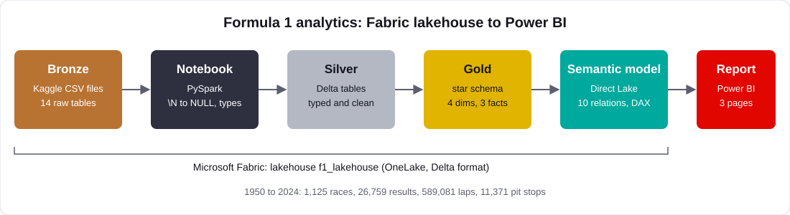
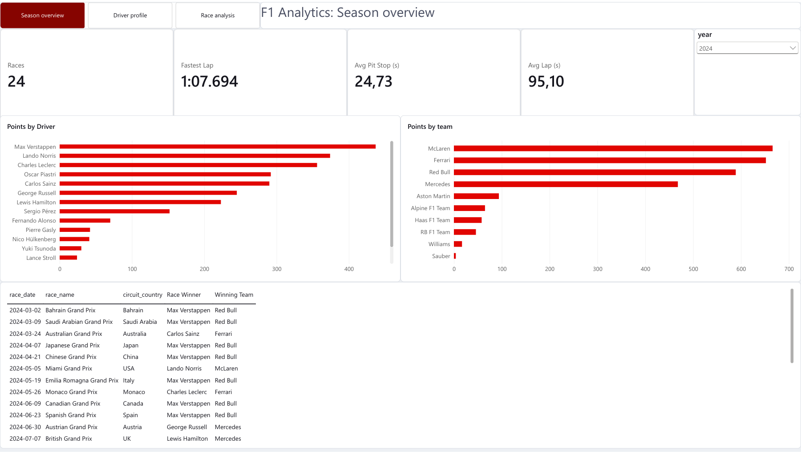
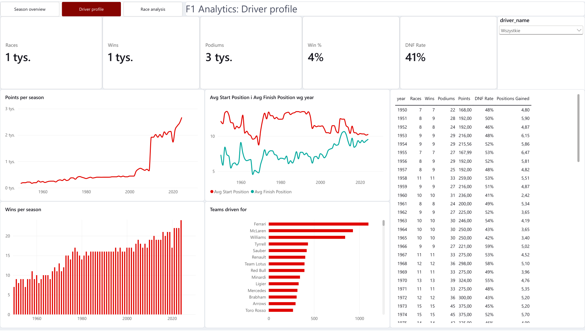
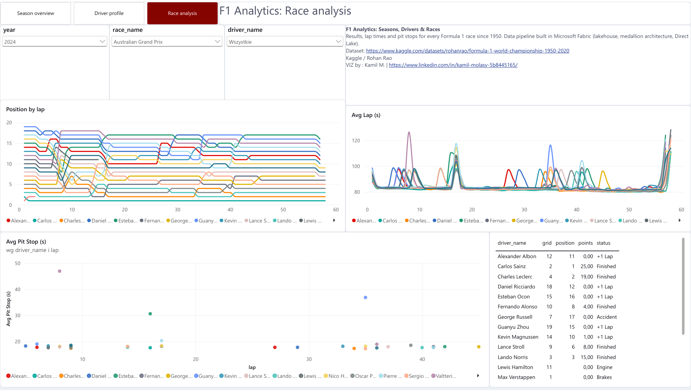

# F1 Analytics: Fabric lakehouse to Power BI

An end-to-end data project on 75 seasons of Formula 1 (1950 to 2024): raw CSV files are cleaned in a Microsoft Fabric lakehouse with PySpark, modelled into a star schema, served through a Direct Lake semantic model and explored in a three-page Power BI report.



## What it covers

| Layer | What happens |
|---|---|
| **Bronze** | Raw CSV files from the Kaggle *Formula 1 World Championship* dataset, stored as-is in the lakehouse `Files/` area |
| **Silver** | 14 typed Delta tables. The dataset marks missing values with the text `\N`; the notebook converts them to real NULLs, so columns like `position` become integers instead of strings |
| **Gold** | Star schema: 4 dimensions (`dim_driver`, `dim_constructor`, `dim_race`, `dim_status`) and 3 facts (`fact_results`, `fact_laps`, `fact_pit_stops`) |
| **Semantic model** | Direct Lake model with 10 many-to-one relationships and DAX measures |
| **Report** | Season overview, Driver profile, Race analysis |

Volume: 1,125 races, 26,759 results, 589,081 laps, 11,371 pit stops.

## Report pages

The full report is in [`f1_report.pdf`](f1_report.pdf).

**Season overview**: standings for any season, KPIs and a race calendar with winners.



**Driver profile**: career arc of a driver, start vs finish positions, wins per season and teams driven for.



**Race analysis**: position by lap, race pace, pit stops and the final classification for a chosen race.



## Things worth knowing (the interesting problems)

- **Missing values are `\N`.** Read naively, a numeric column like `results.position` turns into text. Setting `nullValue = "\\N"` in the CSV reader fixes it at the source, and it gives a clean `is_dnf` flag (no classified position).
- **Sprint races were missing from the standings.** The first version showed 2024 totals that were too low (Verstappen about 400 instead of 437). Sprint points live in a separate table; adding them to `fact_results` as `total_points` made the numbers match the official standings.
- **Laps and pit stops had no constructor.** They only carry `driverId`, so slicing by team was impossible. A small bridge from `results` (race and driver to constructor) adds `constructorId` to both facts.
- **A fact table filter does not propagate to dimensions.** Measures like `Race Winner` use `MAXX(FILTER(...), RELATED(...))` instead of filtering the dimension directly.
- **Pit stop averages are cleaned.** Stops longer than 60 seconds (red flags) are excluded, otherwise they distort the average.
- **Direct Lake reports cannot use "Publish to web".** The live version only works inside Fabric (and while the trial capacity is active), which is why this folder documents the pipeline and includes the report as a PDF.

## Key measures

```DAX
Wins = SUM(fact_results[is_win])
Points = SUM(fact_results[total_points])
DNF Rate = DIVIDE(SUM(fact_results[is_dnf]), COUNTROWS(fact_results))
Avg Start Position = CALCULATE(AVERAGE(fact_results[grid]), fact_results[grid] > 0)
Positions Gained = [Avg Start Position] - [Avg Finish Position]
Driver Rank = RANKX(ALL(dim_driver[driver_name]), [Points], , DESC)

Avg Pit Stop (s) =
    AVERAGEX(FILTER(fact_pit_stops, fact_pit_stops[pit_ms] <= 60000), fact_pit_stops[pit_ms]) / 1000

Race Winner =
    MAXX(FILTER(fact_results, fact_results[is_win] = 1), RELATED(dim_driver[driver_name]))
```

## Files

| File | Purpose |
|---|---|
| `01_f1_medallion_pipeline.ipynb` | The PySpark notebook: bronze to silver to gold, with a validation cell at the end |
| `architecture.svg` | Architecture diagram |
| `f1_report.pdf` | Export of the three report pages |
| `f1_dark_theme.json`, `f1_soft_theme.json`, `f1_light_theme.json` | Power BI report themes |
| `images/` | Report screenshots |

## How to reproduce

1. Create a Fabric workspace on a trial or paid capacity, add a lakehouse `f1_lakehouse` and upload the Kaggle CSV files to `Files/`.
2. Import `01_f1_medallion_pipeline.ipynb`, set `f1_lakehouse` as the default lakehouse and run all cells. The last cell should print Verstappen 437, Norris 374 and Leclerc 356 for 2024.
3. Create a semantic model from the `gold` tables, add the relationships (each fact to `dim_race`, `dim_driver`, `dim_constructor`; `fact_results` also to `dim_status`) and the measures.
4. Build the report in Power BI Desktop with a live connection and apply one of the themes.

## Data

[Formula 1 World Championship (1950 - 2020)](https://www.kaggle.com/datasets/rohanrao/formula-1-world-championship-1950-2020) by Rohan Rao on Kaggle (based on the Ergast database). The CSV files are not stored in this repository.
